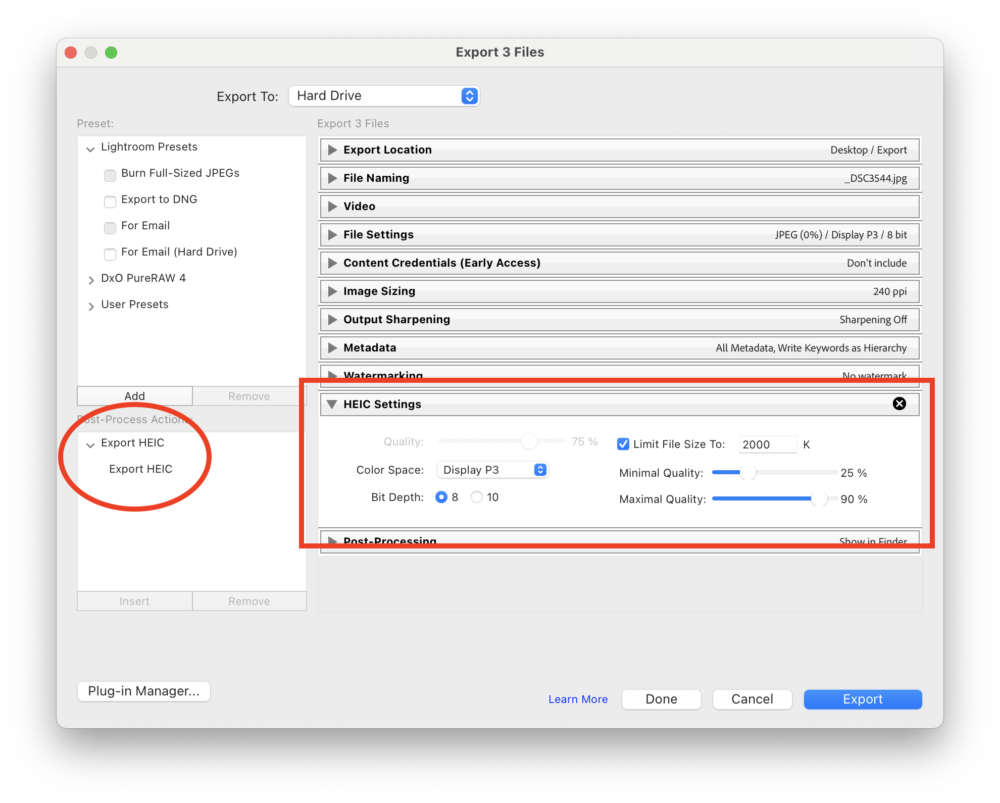
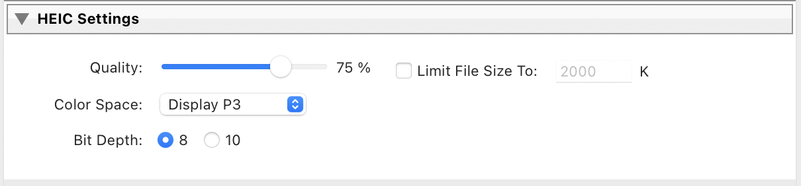
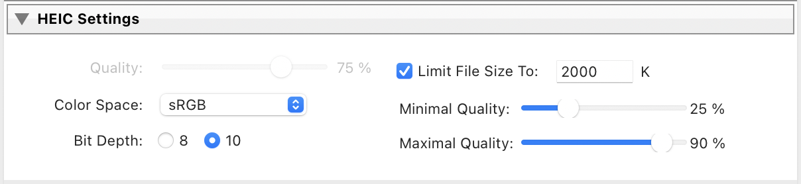

# LRExportHEIC

A plugin to allow Lightroom Classic to export HEIC / HEIF files.

### Why HEIC/HEIF over JPEG?

HEIC (High-Efficiency Image Container) is a modern image format based on HEIF
and the HEVC codec, offering smaller file sizes with less quality loss.
Introduced by Apple in 2017 as the default for iPhones, it is now supported by
major platforms and newer cameras like the Sony A7 IV and Canon R5.

There are two main benefits of HEIC/HEIF:

- A better compression algorithm, meaning either a lower file size for the same
  perceived quality (typically 50% smaller[^1]), or a higher quality image
  at the same file size[^2].
- 10-bit encoding support, allowing for a wider dynamic range and giving more
  latitude for further edits than the 8-bit JPEG.

## Installation

- Download the ZIP file from the
  [latest release](https://github.com/YoungCatChen/LRExportHEIC/releases/latest).
  - Alternatively, download it from
    [Adobe Exchange](https://exchange.adobe.com/apps/cc/108244/export-heic).
- Unzip it to reveal the `ExportHEIC.lrplugin` file. Place it in a place that
  you won’t delete.
- Open Lightroom Classic. From the `File` menu, open the `Plug-in Manager`.
- Click the `Add` button, and select the plugin wherever you saved it. Make sure
  it is enabled.

## Usage

- Select images and start the export like normal (e.g. Right click + Export).
- You will see a new “Post-Process Action” in the lower left corner of the
  export dialog, which you will need to highlight and then click `Insert`.
- You will see a new panel named "HEIC settings" at the bottom. Note that the
  regular File Settings panel is unused at this point; all settings made in
  that panel will be overridden by any setting you choose in the
  “HEIC settings” panel.
- Adjust the settings based on quality or file-size.

- Click `Export`. Your export should proceed like normal, and you will find
  your files at the location you selected.
- The files will have a `.jpg` extension. This is expected. You can rename
  them to use a `.heic` extension or leave them with the `.jpg` extension.
  Most applications won’t care about the extension, and will be able to use
  the file like normal.

The plugin also adds a new item under “Export To” named “Export HEIC”.
This does nothing more than hide the original “File Settings” panel so
you don't accidentally make changes there instead of the “HEIC settings” panel.
However, this is entirely optional and only a cosmetic change.

## Compatibility

macOS only; okay on both Apple M1-M4 chips and Intel chips.

Because the CLI component is using macOS APIs to create the HEIC/HEIF file,
the only supported platform is macOS. Theoretically there should be nothing
preventing it from working on earlier versions, but I have only personally
tested it on macOS Monterey (v12+). It definitely won’t work on Windows.

I have tested the plugin to work with Lightroom Classic version v11 and newer.

## Development

Please refer to [`DEVELOP.md`](DEVELOP.md).

[^1]: Comparing JPEG vs HEIC: Which Is Best?
https://cloudinary.com/guides/image-formats/jpeg-vs-heic

[^2]: Comparison between JPEG, JPEG 2000, JPEG XR and HEIF.
https://commons.wikimedia.org/wiki/File:Comparison_between_JPEG,_JPEG_2000,_JPEG_XR_and_HEIF.png
