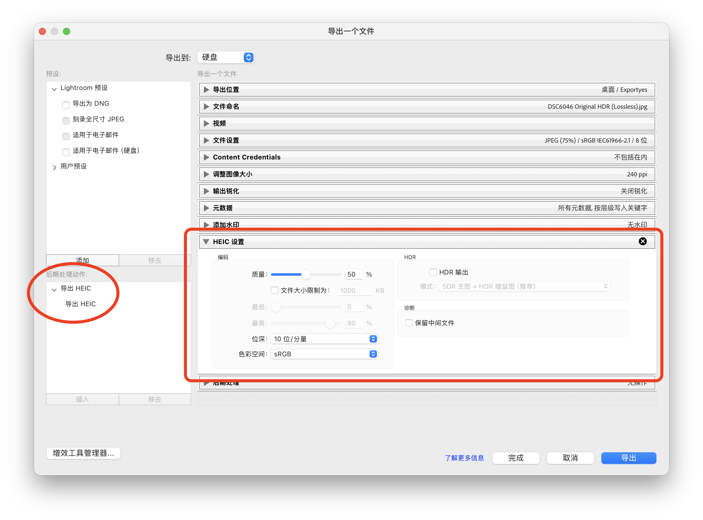
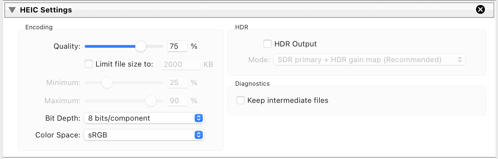
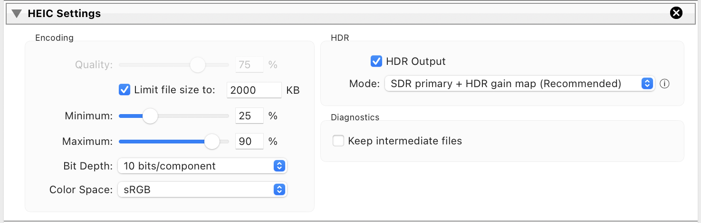

# LRExportHEIC

[English](README.md) · [简体中文](README.zh-CN.md)

_（派生自 [milch/LRExportHEIC](https://github.com/milch/LRExportHEIC)。）_

这是一个让 Lightroom Classic 能够导出 HEIC / HEIF 文件的插件。

### 为什么选择 HEIC/HEIF，而不是 JPEG？

HEIC（高效率图像容器，High-Efficiency Image Container）是一种基于 HEIF
和 HEVC 编解码器的现代图像格式，能以更小的文件保留更高的图像质量。Apple
于 2017 年将其引入并设为 iPhone 的默认图像格式；如今，各大平台以及 Sony
A7 IV、Canon R5 等较新的相机都已支持这种格式。

HEIC/HEIF 主要有两项优势：

- 更高效的压缩算法：在感知质量相同的情况下，文件通常可缩小约 50%[^1]；
  或者在文件大小相同时获得更高的图像质量[^2]。
- 支持 10 位编码，相比 8 位 JPEG 可容纳更宽的动态范围，也为后续编辑提供
  更大的调整空间。

## 安装

- 从[最新版本](https://github.com/YoungCatChen/LRExportHEIC/releases/latest)
  下载 ZIP 文件。
  - 也可以从 [Adobe Exchange](https://exchange.adobe.com/apps/cc/108244/export-heic)
    下载。
- 解压后会得到 `ExportHEIC.lrplugin` 文件。请将它放在不会被误删的位置。
- 打开 Lightroom Classic，从“文件”菜单进入“增效工具管理器”。
- 点击“添加”，选择刚才保存的插件，并确认插件已启用。

## 使用方法

- 选择图像并像往常一样开始导出（例如右键选择“导出”）。
- 导出窗口左下角会出现一个新的“后期处理动作”（Post-Process Action）。选中
  它，然后点击“插入”。
- 窗口底部会出现新的“HEIC 设置”面板。此时 Lightroom 原有的“文件设置”
  面板不会生效；其中的设置会被“HEIC 设置”面板中的选项覆盖。
- 按照所需的图像质量或文件大小调整设置，也可以调整位深和色彩空间。
- 对于 HDR（高动态范围）照片，可以启用“HDR 输出”。HDR 模式既可以保存
  带 HDR 增益图的 SDR（标准动态范围）主图，也可以保存不带增益图的原生 HDR
  主图。

- 点击“导出”。导出过程与平时相同，完成后可在所选位置找到文件。
- 文件内部为 HEIF/HEIC 数据，但会保留 Lightroom 指定的文件扩展名（通常为
  `.jpg`）。导出滤镜必须写入 Lightroom 要求的目标路径，因此需要保留该扩展名。

插件还会在“导出到”（Export To）下新增一个名为“导出 HEIC”的项目。它只是
隐藏原有的“文件设置”面板，避免误改该面板，而没有其他功能。这个项目完全
可选，只用于调整界面显示。

## 兼容性

仅支持 macOS；兼容 Apple M1–M5 芯片和 Intel 芯片。

由于命令行组件使用 macOS API 创建 HEIC/HEIF 文件，因此仅支持 macOS。
理论上没有什么会阻碍 SDR 导出在更早的系统版本上运行，但目前仅在 macOS
Monterey（版本 12 及以上）上进行过测试。HDR HEIC 导出需要 macOS 15 或更高
版本。本插件无法在 Windows 上运行。

本插件已在 Lightroom Classic 11 及更高版本上测试通过。

## 开发

请参阅 [`DEVELOP.md`](DEVELOP.md)。

[^1]: JPEG 与 HEIC 对比：哪一种更好？
https://cloudinary.com/guides/image-formats/jpeg-vs-heic

[^2]: JPEG、JPEG 2000、JPEG XR 与 HEIF 对比。
https://commons.wikimedia.org/wiki/File:Comparison_between_JPEG,_JPEG_2000,_JPEG_XR_and_HEIF.png
